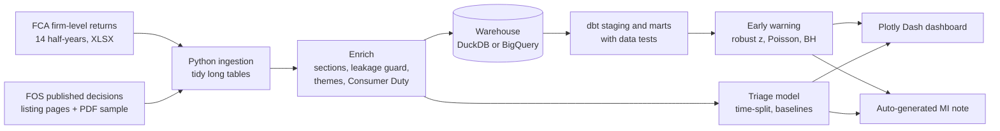

# UK Conduct Risk Early-Warning Monitor

An end-to-end compliance analytics pipeline built on real UK regulatory data. It reads every published Financial Ombudsman Service decision and the FCA's firm-level complaints returns, tags each complaint to a Consumer Duty outcome, flags firms whose complaint picture has moved outside its normal range, and scores complaints by how likely an ombudsman is to uphold them.

It answers three questions a compliance team asks every month:

1. Which firms, products and themes have moved outside their normal range, and why?
2. Which Consumer Duty outcomes are generating the most harm?
3. If we could only review 10% of open complaints, which ones should they be?

## How it fits together



GitHub Actions runs the whole thing on the 3rd of every month and commits the refreshed marts and reports.

## Data sources

| Source | What it gives | Licence |
|---|---|---|
| [FCA firm-level complaints data](https://www.fca.org.uk/data/complaints-data/firm-level) | Complaints opened, closed, upheld and per 1,000 accounts, by firm and product group, every half-year since 2016 | Open Government Licence |
| [FOS decisions database](https://www.financial-ombudsman.org.uk/ombudsman-decisions) | Over 400,000 anonymised final decisions since April 2013, each with firm, sector, outcome and full text | Published by FOS for transparency. Read their terms before crawling |

## Quick start

```bash
git clone https://github.com/RamanDeshlahre/conduct-risk-monitor.git && cd conduct-risk-monitor
make setup                       # virtual environment and dependencies
# Edit config.yaml: put your email in project.contact_email
make test                        # 20 tests, under a minute
make ingest                      # FCA files plus the FOS crawl. Resumable if interrupted
make pdfs                        # optional, adds full decision text for a sample
make enrich warehouse detect model note
make app                         # dashboard on http://localhost:8050
```

The first FOS crawl is the slow part. At the polite rate of one page every 1.5 seconds, each month of decisions (about 3,000) takes around 15 minutes, so back to January 2023 takes several hours. `fos.min_date` in `config.yaml` sets how far back to go. The ombudsman early-warning test needs seven complete months (six of baseline plus the month tested) and the model's month-based split needs twelve; with less, early warning runs on the FCA returns alone and the model falls back to a date-based split. After the first crawl, `make refresh` only fetches what's new.

## What each stage does

**Ingest.** `crm.ingest_fca` downloads 14 half-years of FCA returns and finds each sheet's real header by searching for "Firm Name", because the files have title rows and a hidden byte-order mark. `crm.ingest_fos` reads the decision listing ten at a time, filtered by date and sorted newest first, and, optionally, a stratified sample of full PDFs.

**Enrich.** `crm.sections` splits each decision into its standard sections. The model only ever sees "The complaint", because "What happened" usually reports the investigator's view, and the ombudsman agrees with the investigator most of the time. Any sentence mentioning the investigator, the ombudsman or an outcome is stripped, and the pipeline stops if any slips through. `crm.themes` tags complaints with a transparent rule-based taxonomy mapped to the four Consumer Duty outcomes, and NMF topic modelling surfaces language the rules miss.

**Warehouse.** Raw tables load into DuckDB locally or BigQuery in London (europe-west2). dbt builds staging views and mart tables and runs 26 data tests: uniqueness, accepted values, referential integrity, percentages in range, no future-dated decisions, and source freshness.

**Detect.** `crm.early_warning` combines two independent signals. For FCA returns it uses a robust z-score of the latest half-year against the firm's own history, plus its position among peers on complaints per 1,000 accounts. For ombudsman decisions it runs a Poisson test of this month's count against the trailing 12-month average for each firm and theme, with Benjamini-Hochberg correction because hundreds of pairs are tested at once.

**Model.** `crm.model` trains on older decisions, tunes on the next three months and tests on the newest six, so every reported number is a prediction of the future. It always reports against two baselines, and the model card explains what drives the score.

**Report.** `crm.mi_note` writes a one-page MI note from the marts each month. The dashboard has three views: the watchlist, a firm drill-down and Consumer Duty themes with model performance. Watchlist filtering and summary copying run as clientside JavaScript callbacks.

Full detail is in [docs/methodology.md](docs/methodology.md).

## Using BigQuery instead of DuckDB

```bash
pip install dbt-bigquery "google-cloud-bigquery[pandas]"
gcloud auth application-default login
# config.yaml: warehouse.target: bigquery and your project id
export CRM_TARGET=bigquery CRM_GCP_PROJECT=<your-project-id>
make warehouse
```

The BigQuery sandbox is free and needs no card. The data here fits comfortably inside its limits.

## Deploying the dashboard

The repo includes a `Procfile`, so it deploys as-is to Render or any host that runs gunicorn. The app reads `data/marts`, which the monthly workflow keeps up to date.

## Project structure

```
config.yaml            every threshold and setting in one place
taxonomy/themes.yaml   theme rules and Consumer Duty mapping, with a rationale for each
src/crm/               ingestion, enrichment, early warning, model, MI note, pipeline
dbt/                   staging and mart models, data tests, name-override seed
app/                   Plotly Dash dashboard and clientside JavaScript
tests/                 parser and analytics tests
docs/methodology.md    methods, limitations and design decisions
CHANGES.md             bugs found on the first real-data run and how they were fixed
reports/               generated: MI note, model card, data quality (JSON and Markdown), theme discovery
```

## Limitations

Published decisions are complaints that reached a final ombudsman decision, so they over-represent disputed cases and say nothing about complaints firms resolved themselves. FCA returns only name firms reporting 500 or more complaints in six months, and each firm reports on its own financial year. Theme tags are rule-based, so they're auditable but imperfect. The uphold model reflects the ombudsman's approach at the time it was trained, which moves with policy.

## Responsible use

The crawler identifies itself, waits between requests, retries with back-off and resumes from checkpoints so nothing is fetched twice. Check the FOS website's terms and robots.txt before running it. Decisions are anonymised by FOS, and this project stores no personal data beyond what FOS publishes.
